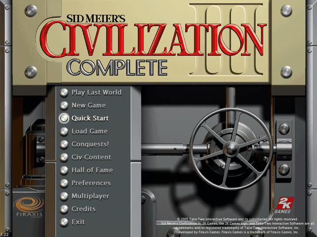
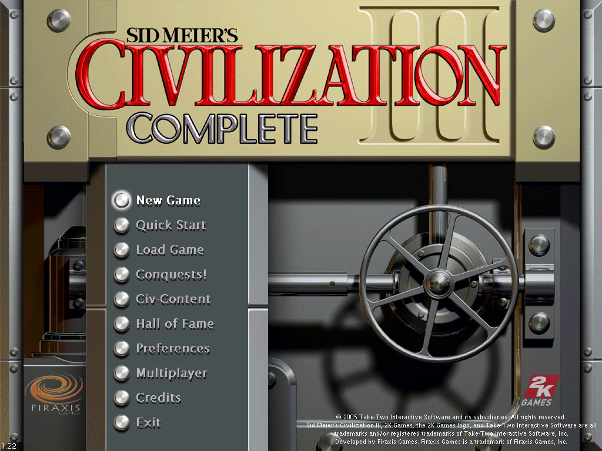
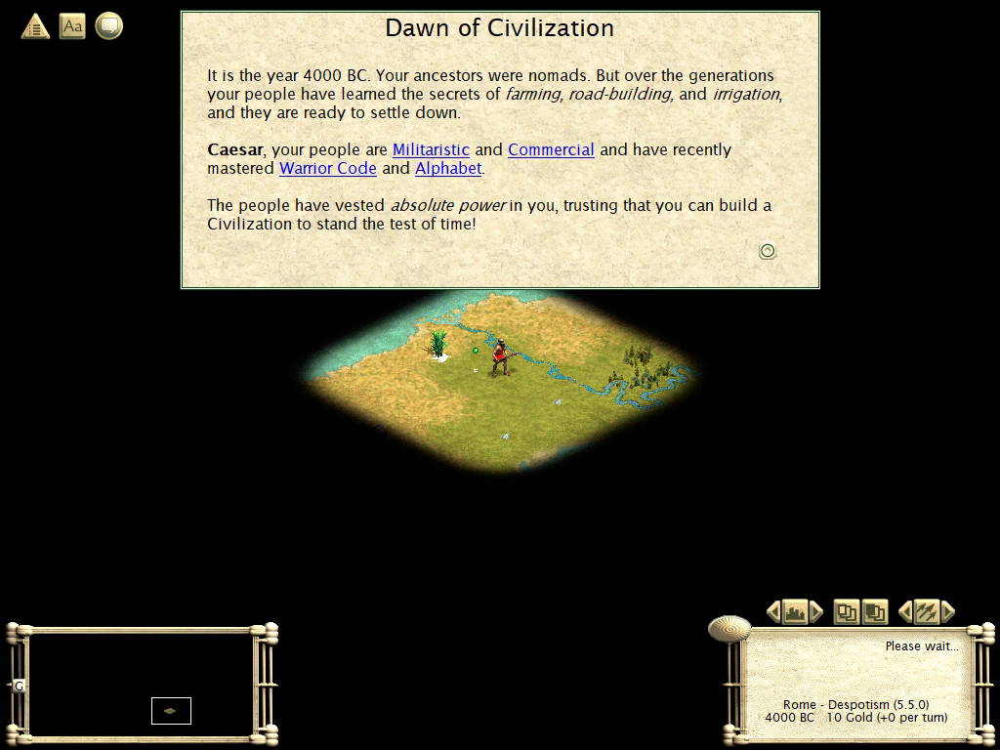
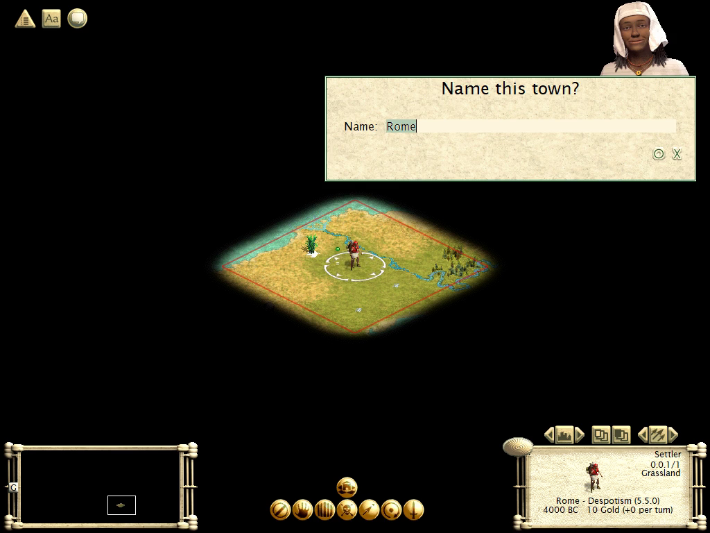
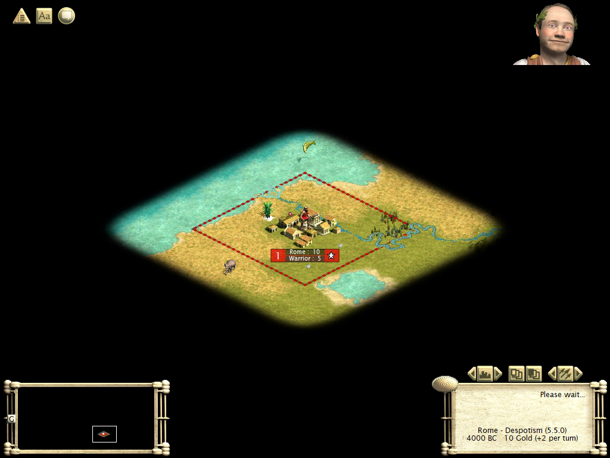
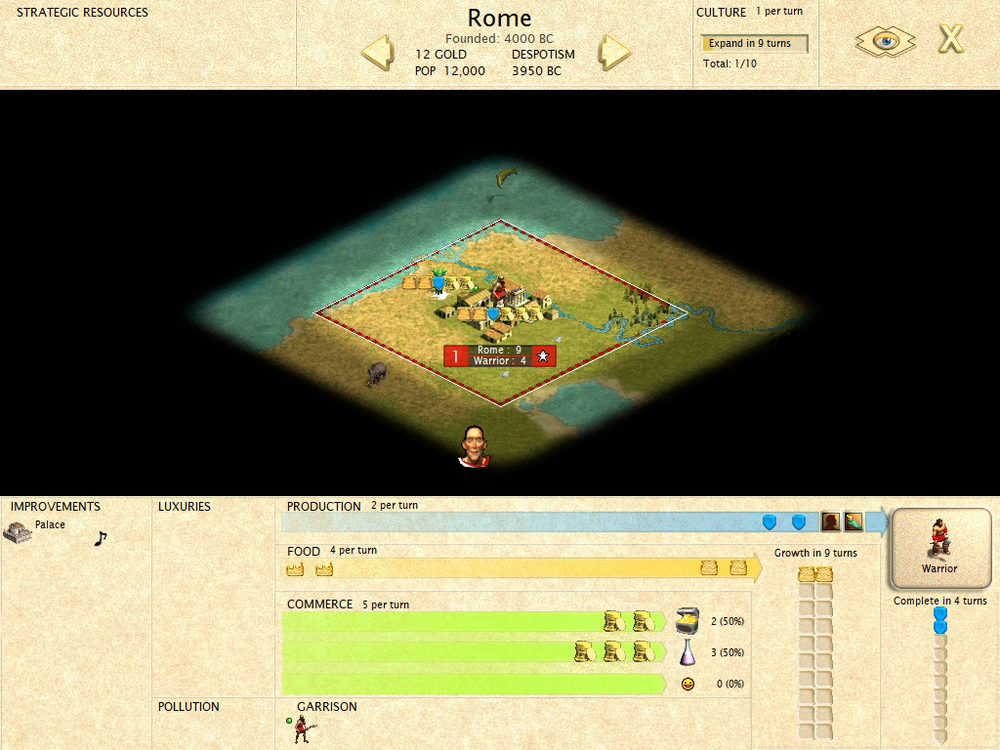

# Civilization III: Conquests — Static Recompilation

A static recompilation of **Sid Meier's Civilization III: Conquests**
(Firaxis, 2003; the 2015 Steam "Complete" build) from the shipping Win32
executable to C, compiled fresh and run natively on modern Windows.



*The recompiled game, recorded with `--headless --record` and a scripted
mouse and keyboard: main menu, Quick Start, found Rome, end the first turn.
Sped up 5x.*

Built on the [pcrecomp](https://github.com/sp00nznet/pcrecomp) toolchain and
following its shared house style (layout, CLI, harness, headless mode). It sits
next to [civ](https://github.com/sp00nznet/civ) (the 1991 original) and
civ2 in the same collection.

**This is an unofficial fan project, not affiliated with Firaxis Games or
Take-Two Interactive.** No game files are in this repository, and neither is
the generated C: you supply your own copy and the pipeline builds everything
locally.

## Status: v0.1.0-dev, alpha. The whole game is lifted, boots, and plays: Quick Start, found a city, end the turn.

| Stage | State |
|---|---|
| P0: pick the build | done: Steam `Civ3Conquests.exe`, VC6, no DRM ([RECON.md](docs/RECON.md)) |
| Function catalog (`disasm32`, vtable seeds) | 15,308 functions, 95.2% of `.text`, about 10 minutes |
| Lift (`run_lift.py --all`) | **15,929 functions, 6.3M lines of C, 0 lift errors**, 0 not-lifted stubs |
| Host (`build/civ3.exe`, 32-bit, pcrecomp `native32`) | **plays**: CRT, WinMain, Steam init, jgl.dll renderer, sound.dll, main menu, a new game, the first turn and the AI's turn ([host.md](docs/host.md), [bringup.md](docs/bringup.md)) |
| Headless mode | `--headless --record out.mp4`: hidden window, jgl's GDI blits mirrored to ffmpeg. Works over RDP |
| Scripted input | `--move`, `--click`, `--key`: mouse and keyboard as posted window messages |
| Conformance harness | `tools/conformance.py`: **7/7 milestones**, through a scripted Quick Start into a game; lift health; fails on regression |

### Compatibility

| Mode | State |
|---|---|
| Main menu | works. Like the original, the first click on an item selects it and the second activates it |
| Quick Start, found a city, city screen, end turn | works (scripted headless run, 4000 BC to 3950 BC) |
| New Game setup screens, Load Game, later eras | not tested yet |
| Intro movie (Bink) | runs (`_BinkWait` in the call trail), not captured by `--record` |
| Windowed/full-screen play at the console | not tested yet: every run so far was headless over RDP |
| Multiplayer, force feedback | not tested |

## Screenshots

Rendered by the recompiled executable and recorded headlessly
(`--headless --record`) over RDP. Main menu, then a scripted Quick Start:



| | |
|---|---|
|  |  |

| | |
|---|---|
|  |  |

## Getting Started

You need **your own copy of Civilization III Complete** (Steam app 3910). Only
the Steam build is supported: the retail discs' executables are different
builds. Nothing from the game is in this repository and nothing is downloaded
for you.

### Quick start

1. Download this repository (the green **Code** button, then **Download ZIP**)
   and unzip it somewhere with 4 GB free.
2. Install **Visual Studio 2022 Build Tools** with *Desktop development with
   C++* (free, from visualstudio.microsoft.com). It is the one prerequisite
   Setup cannot install for you.
3. Double-click **`Setup.cmd`**.

It checks for Python 3.10+, the `pefile` and `capstone` packages, CMake,
Ninja and the pcrecomp toolkit, and **asks** before installing any of them.
It finds Civilization III in your Steam library, or asks for the folder. Then
it copies the game into `game\`, catalogs and lifts the executable, and
compiles the host. That takes about 45 minutes the first time; a rerun skips
the finished steps. If it stops, it says why in one sentence, and the details
are in `setup.log`.

It ends with **`Civ3 Recomp.cmd`** in the repository folder, which runs the
recompiled game.

### Step by step

Prerequisites: Windows 10/11, **Python 3.10+** (`py -3 --version`),
**git**, **Visual Studio 2022** (any edition, or the Build Tools) with the C++
x86 tools, **CMake 3.20+** and **Ninja**, and the pcrecomp toolkit cloned
**beside** this repository as `tools`:

```
some-folder\
  tools\        <- git clone https://github.com/sp00nznet/pcrecomp tools
  civ3\         <- this repository
```

1. Python packages:
   ```
   py -3 -m pip install --user pefile capstone
   ```
2. Copy your install into `game\`, and the executable into `work\`:
   ```
   robocopy "C:\Program Files (x86)\Steam\steamapps\common\Sid Meier's Civilization III Complete" game /E
   mkdir work
   copy game\Conquests\Civ3Conquests.exe work\
   ```
3. Vtables (Civ3 has no RTTI, so they are found structurally):
   ```
   py -3 ..\tools\tools\cpp\vtable_scan.py work\Civ3Conquests.exe --seeds work\vtable_seeds.json
   ```
   Expected: `vtable candidates : 135` and `distinct methods  : 1,799`.
4. The function catalog (about 10 minutes):
   ```
   py -3 ..\tools\tools\disasm\disasm32.py work\Civ3Conquests.exe -o work\functions.json --seed-functions work\vtable_seeds.json
   ```
   Expected, at the end: `Functions: 15308` and `Byte coverage: 2,500,807 / 2,625,536 (95.2% of code range)`.
5. Lift (about 4 minutes):
   ```
   py -3 run_lift.py --all
   ```
   Expected: `lifted 15929   not-lifted stubs 0   errors 0   no terminator 59`.
6. Build (about 30 minutes; `build.cmd` sets up the MSVC x86 environment itself):
   ```
   build.cmd
   ```
7. Check it:
   ```
   build\civ3.exe --headless
   ```
   Expected: `[bind] 0x00400000: 238 native, 0 guest, 7 shimmed, 0 unresolved`,
   then `(dry run: image mapped and bound; --run enters 0x0066B0A9)`.

The usual trip-ups: `python` opening the Microsoft Store (that is Windows'
alias placeholder; use `py -3`, or turn the alias off in *Settings > Apps >
Advanced app settings > App execution aliases*); a freshly installed tool not
being on `PATH` until you open a new window; and building from a 64-bit-only
prompt (`build.cmd` exists to pick the `amd64_x86` compiler; the host must be
32-bit).

## Usage

From the repository root:

```
build\civ3.exe --run                                                  # a window (untested: every run so far was headless)
build\civ3.exe --headless --run --watchdog 120                        # boot, report, stop
build\civ3.exe --headless --run --record work\boot.mp4 --watchdog 200 # record to the main menu
build\civ3.exe --headless --run --record work\qs.mp4 --watchdog 200 --move 291,383@6 --click 291,383@8 --click 291,383@11
build\civ3.exe --help                                                 # every option
```

`--headless` keeps everything off the screen (a hidden window, display-mode
changes ignored, message boxes to stderr), so it is safe over RDP. `--record`
needs `ffmpeg` on `PATH`. Script times are seconds after the first frame
reaches the window; x,y are 1024x768 client pixels. The Quick Start line
clicks the item twice: the first click selects, the second activates. The
full first-turn script is in [bringup.md](docs/bringup.md#4-menu-clicks-two-clicks-not-one).

## Building from source

The *Step by step* route above is the build. `py -3 tools\conformance.py`
then runs the boot and compares it against `conformance.json`:

```
boot milestones: 7/7  (exit 4)
  [x] image mapped and imports bound
  [x] entry point entered
  [x] jgl.dll loaded
  [x] game window created
  [x] first frame presented
  [x] main menu open
  [x] Quick Start taken, in a game
lift: 15929 functions, 0 errors, 59 with no terminator, 2 unresolvable ITAIL labels
```

Without `game\` and a build it skips with a message, so it can run in CI.
`CIV3_TRACE=ON` (`set CMAKE_ARGS=-DCIV3_TRACE=ON`, `set BUILD_DIR=build-trace`)
builds a variant with pcrecomp's function-entry tracing (`--firsthit`,
`--calltrace`, ...).

## Layout

```
civ3/
  Setup.cmd          the Quick start (runs tools\setup.ps1)
  run_lift.py        lift driver: pcrecomp's lift32 over the whole catalog
  CMakeLists.txt, build.cmd   the 32-bit host build
  src/runtime/host.c    the host on pcrecomp runtime/native32
  src/runtime/record.c  jgl.dll hooks: 16-bit colour shim, headless, --record
  src/runtime/input.c   scripted input, [game] milestones, --peek
  src/recomp/gen/    lifted C (generated, gitignored, never committed)
  tools/conformance.py  the boot/lift harness; conformance.json is its baseline
  docs/              RECON.md, host.md, bringup.md
  game/              your install (gitignored)
  work/              executable copy, catalog, logs, recordings (gitignored)
```

## License

MIT for the code in this repository ([LICENSE](LICENSE)). Civilization III is
© Take-Two Interactive; none of it is here, and the generated source derived
from it is never distributed.
